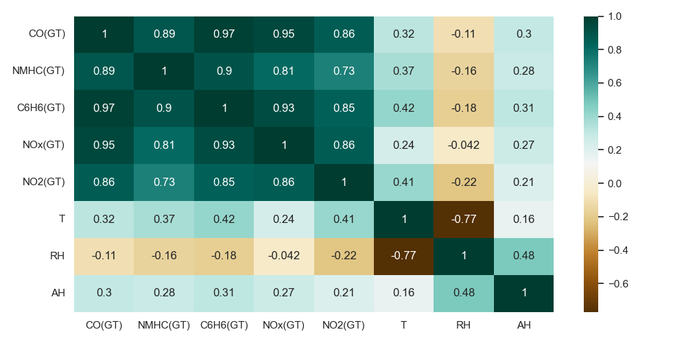

# Python Data Processing Pipeline

## Visualization Preview


> This visualization shows feature correlations within the dataset, helping identify relationships between variables and supporting model development.

---

## Project Overview

This project implements a complete Python pipeline for loading, cleaning, analyzing, and modeling monitoring data using multivariable linear regression.

The goal is to simulate a real-world data processing workflow, including preprocessing, visualization, and model evaluation.

---

## Features

- Data ingestion from CSV files  
- Data cleaning and preprocessing  
- Handling invalid values (`-200`)  
- Feature scaling (normalization)  
- Correlation analysis and visualization  
- Multivariable linear regression (from scratch)  
- Gradient Descent and Normal Equation  
- Model evaluation using R² and Adjusted R²  
- Data visualization (heatmap, pairplot, loss curve)  
- Modular project structure (production-style)  
- Basic unit testing  

---

## Project Structure

````
python-data-processing-pipeline/
├── data/
│ ├── raw/
│ └── processed/
├── outputs/
│ ├── plots/
│ └── metrics/
├── src/
├── tests/
├── notebooks/
├── main.py
├── requirements.txt
└── README.md

````

---

## Installation

```bash
git clone https://github.com/oumaimabnz/python-data-processing-pipeline
cd python-data-processing-pipeline
python -m venv .venv
```
Activate the virtual environment:

Windows:
```bash
.venv\Scripts\activate
```

macOS/Linux:
```bash
macOS/Linux
```

Install dependencies:
```bash
pip install -r requirements.txt
```

---

## Run the Pipeline:
```bash
python main.py
```
This will:

- Clean the dataset
- Train regression models
- Generate visualizations
- Save evaluation metrics

## Run Tests 
```bash
pytest
```

---

## Outputs

The pipeline generates:

- Cleaned dataset (CSV & JSON)
- Correlation heatmap
- Pairplot visualization
- Loss curve
- Evaluation metrics (R², Adjusted R²)

---

## Notebook

The notebooks/exploration.ipynb file contains exploratory data analysis and initial experiments.

---

## Technologies
- Python
- Pandas
- NumPy
- Matplotlib
- Seaborn
- Scikit-learn
- Pytest

---

📌 Note

This project was developed as a structured data processing pipeline inspired by real-world monitoring systems.

---

## Author

Oumaima Benaziza
